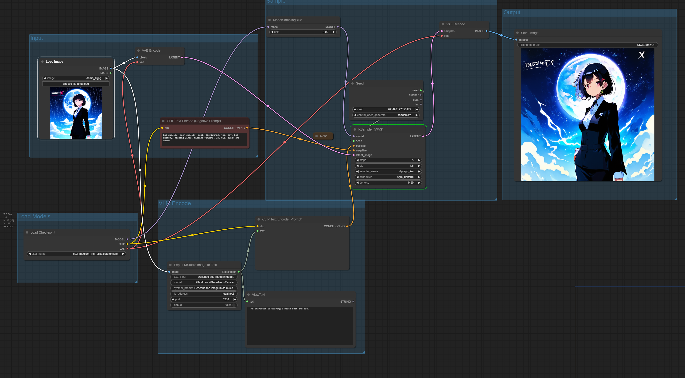

# LM Studio Nodes for ComfyUI

This extension provides custom nodes for ComfyUI that integrate LM Studio's capabilities. It offers two main functionalities:

1. Image to Text: Generate text descriptions of images using vision models.
2. Text Generation: Generate text based on a given prompt using language models.

Both nodes are designed to work with LM Studio's local API, providing flexible and customizable ways to enhance your ComfyUI workflows.

## Workflow Example

Here's an example of how the LM Studio nodes can be used in a ComfyUI workflow:



## Features

- Generate text descriptions of images using LM Studio's vision models
- Generate text based on prompts using LM Studio's language models
- Customizable system prompts
- Flexible model selection
- Configurable server address and port
- Debug mode for troubleshooting

## Installation

1. Clone this repository into your ComfyUI's `custom_nodes` directory:
   ```
   cd /path/to/ComfyUI/custom_nodes
   git clone https://github.com/mattjohnpowell/comfyui-lmstudio-nodes.git
   ```
2. Restart ComfyUI or reload custom nodes.

## Usage

### LM Studio Image To Text Node

Add the "LM Studio Image To Text" node to your ComfyUI workflow. Connect an image output to the "image" input of the node.

#### Inputs

- **image** (required): The input image to be described.
- **text_input** (required): The prompt for the image description. Default: "What's in this image?"
- **model** (required): The name of the LM Studio vision model to use. Default: "billborkowski/llava-NousResearch_Nous-Hermes-2-Vision-GGUF"
- **system_prompt** (required): The system prompt to set the context for the AI. Default: "This is a chat between a user and an assistant. The assistant is helping the user to describe an image."
- **ip_address** (required): The IP address of your LM Studio server. Default: "localhost"
- **port** (required): The port number of your LM Studio server. Default: 1234
- **debug** (optional): Set to True for detailed logging. Default: False

#### Output

- **Description**: The generated text description of the input image.

### LM Studio Text Generation Node

Add the "LM Studio Text Generation" node to your ComfyUI workflow.

#### Inputs

- **prompt** (required): The input prompt for text generation.
- **model** (required): The name of the LM Studio language model to use. Default: "TheBloke/Llama-2-13B-chat-GGUF"
- **system_prompt** (required): The system prompt to set the context for the AI. Default: "You are a helpful AI assistant."
- **ip_address** (required): The IP address of your LM Studio server. Default: "localhost"
- **port** (required): The port number of your LM Studio server. Default: 1234
- **max_tokens** (optional): Maximum number of tokens to generate. Default: 1000
- **temperature** (optional): Controls randomness in generation. Default: 0.7
- **debug** (optional): Set to True for detailed logging. Default: False

#### Output

- **Generated Text**: The generated text based on the input prompt.

## LM Studio Setup

1. Install and run LM Studio on your local machine.
2. Load appropriate models in LM Studio (vision models for Image to Text, language models for Text Generation).
3. Ensure the LM Studio API is running and accessible (default: http://localhost:1234).

## Notes

- This extension is adapted from the LM Studio code examples for image-to-text and text generation.
- The `model` parameter doesn't have to be changed from its default value, but it's useful to set it explicitly when sharing workflows to ensure consistency.
- Adjust the `ip_address` and `port` if your LM Studio instance is running on a different machine or port.

## Original LM Studio Code

This extension is adapted from LM Studio code examples. Here's the original image-to-text example:

```python
# Adapted from OpenAI's Vision example
from openai import OpenAI
import base64
import requests

# Point to the local server
client = OpenAI(base_url="http://localhost:1234/v1", api_key="lm-studio")

# Ask the user for a path on the filesystem:
path = input("Enter a local filepath to an image: ")

# Read the image and encode it to base64:
base64_image = ""
try:
    image = open(path.replace("'", ""), "rb").read()
    base64_image = base64.b64encode(image).decode("utf-8")
except:
    print("Couldn't read the image. Make sure the path is correct and the file exists.")
    exit()

completion = client.chat.completions.create(
    model="moondream/moondream2-gguf",
    messages=[
        {
            "role": "system",
            "content": "This is a chat between a user and an assistant. The assistant is helping the user to describe an image.",
        },
        {
            "role": "user",
            "content": [
                {"type": "text", "text": "What's in this image?"},
                {
                    "type": "image_url",
                    "image_url": {
                        "url": f"data:image/jpeg;base64,{base64_image}"
                    },
                },
            ],
        }
    ],
    max_tokens=1000,
    stream=True
)

for chunk in completion:
    if chunk.choices[0].delta.content:
        print(chunk.choices[0].delta.content, end="", flush=True)
```

## Troubleshooting

If you encounter any issues:
1. Enable debug mode by setting the `debug` input to True.
2. Check the ComfyUI console for error messages and debug output.
3. Verify that LM Studio is running and accessible at the specified IP address and port.
4. Ensure you're using compatible models in LM Studio (vision models for Image to Text, language models for Text Generation).

For further assistance, please open an issue on the GitHub repository.

## License

This project is licensed under the MIT License - see the [LICENSE](LICENSE) file for details.

## Acknowledgments

- This project is built upon the ComfyUI framework.
- Inspired by and adapted from LM Studio's image-to-text and text generation example code.